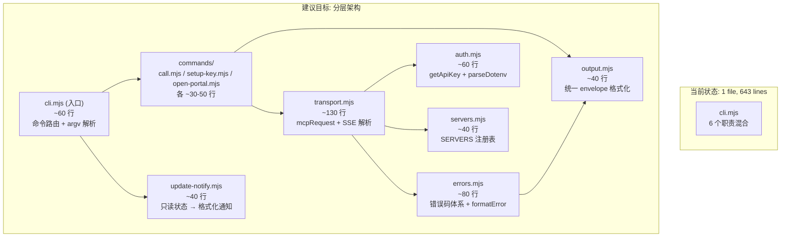

# cli.mjs 架构分析：职责膨胀与输出一致性问题

## 1. 现状概览

[cli.mjs](file:///Users/hongling/Dev/wind-git/wind-skills-dev/skills/wind-mcp-skill/scripts/cli.mjs) 是 wind-mcp-skill 的唯一脚本入口，643 行，承担了 **MCP 桥接** 的核心使命，但同时混入了大量正交职责。

---

## 2. 职责清单（6 个正交关注点）

| # | 职责 | 行范围 | 复杂度 | 本质角色 |
|---|------|--------|--------|----------|
| ① | **MCP JSON-RPC 传输** | L333-460 | 高 | HTTP client + SSE 解析 + JSON-RPC 协议处理 |
| ② | **错误码体系** | L268-331 | 中 | 错误分类 + 模式匹配 + 提示生成 + fallback hint 拼接 |
| ③ | **认证与配置** | L195-266 | 中 | API Key 多源查找 + dotenv 解析 + config.json 读写 |
| ④ | **命令路由** | L462-628 | 中 | `call` / `setup-key` / `open-portal` + 参数校验 + USAGE |
| ⑤ | **更新检测通知** | L60-179 | 高 | spawn 子进程 + lock 文件遍历 + hash 比对 + snooze + 状态修正 + 打印 |
| ⑥ | **服务器注册表** | L18-51 | 低 | 8 个 server endpoint 硬编码 |

> **核心矛盾**：① 是 MCP 桥接的本职，②③ 是桥接的必要支撑，但 ④⑤⑥ 是完全正交的关注点。尤其 ⑤ 占了 ~120 行，是一个独立的"升级感知子系统"。

---

## 3. 输出一致性分析

这是给 Agent 消费的脚本，但输出缺乏统一的 **envelope 规范**。

### 3.1 成功路径的输出

| 命令 | 输出通道 | 格式 | envelope |
|------|----------|------|----------|
| `call` 成功 | **stdout** | `{ ok: true, server_type, tool, ...result }` | ✅ 有 `ok` 字段 |
| `setup-key` 成功 | **stdout** | `{ ok: true, action, scope, path, key_masked, next }` | ✅ 有 `ok` 字段 |
| `open-portal` 成功 | **stdout** | `{ ok: true/false, action, url, platform, ... }` | ⚠️ `ok` 可以是 false（spawn 失败），但走的是 stdout |

### 3.2 错误路径的输出

| 场景 | 输出通道 | 格式 | 问题 |
|------|----------|------|------|
| `die()` 错误 | **stderr** | 人类可读多行文本（`❌ MCP 错误 [CODE]\n...`） | ❌ **非 JSON**，Agent 需要正则解析 |
| `exitWithUsage()` | **stderr** | 人类可读纯文本 | ❌ **非 JSON**，且没有错误码 |
| 更新通知 | **stderr** | 人类可读中文多行 | ❌ **非 JSON**，混在错误输出通道里 |
| 未知异常 | **stderr** | `die('UNKNOWN', ...)` → 人类可读 | ❌ **非 JSON** |

### 3.3 核心问题

```
┌─────────────────────────────────────────────────────────┐
│  Agent 看到的是：                                        │
│                                                         │
│  stdout: JSON  (但只有成功时)                            │
│  stderr: 人类可读文本 (错误 + 帮助 + 更新通知混在一起)     │
│  exit code: 0 或 1                                      │
│                                                         │
│  问题：                                                  │
│  1. 错误信息不是 JSON → Agent 无法可靠解析错误码          │
│  2. stderr 混合了 3 种语义：错误 / 帮助 / 通知           │
│  3. open-portal 的 ok:false 走 stdout 而不是 stderr      │
│  4. 没有统一的 response envelope                        │
└─────────────────────────────────────────────────────────┘
```

---

## 4. 逐项详细分析

### 4.1 ❌ 错误输出不是结构化的

```javascript
// 当前：die() 输出人类可读文本到 stderr
function die(code, message, ctx = {}, exitCode = 1) {
  process.stderr.write(formatError(code, message, ctx) + '\n');
  process.exit(exitCode);
}

// formatError 输出的是：
// ❌ MCP 错误 [RATE_LIMIT_DAILY]
//
// server_type: stock_data
// api key:     abc1***def4
// 后端消息:    单日请求次数超限
// 处理建议:    API Key 当日请求额度已用尽...
```

**影响**：Agent 需要用正则从 stderr 提取 `[CODE]` 和 `处理建议:`，不可靠。

**应改为**：stdout 输出 `{ ok: false, error: { code, message, hint, ... } }` 的 JSON envelope。

### 4.2 ⚠️ stderr 的三重语义

当前 stderr 承载了完全不同的信息类型：

| 语义 | 来源 | 示例 |
|------|------|------|
| **致命错误** | `die()` | `❌ MCP 错误 [KEY_MISSING]...` |
| **使用帮助** | `exitWithUsage()` / 主入口 USAGE | 命令用法文本 |
| **旁路通知** | `maybePrintUpdateNotice()` | `[wind-skills] 检测到 N 个 skill 有新版...` |

这三者的消费场景完全不同：
- **错误**：Agent 需要结构化解析来决策重试
- **帮助**：Agent 首次学习命令用法（理论上只看 SKILL.md 就够了）
- **通知**：Agent 需要传达给用户的辅助信息

### 4.3 ⚠️ 更新检测子系统的"寄生"

`maybePrintUpdateNotice()`（L125-179）+ `spawnUpdateCheck()`（L61-68）+ `getInstalledHashes()`（L73-100）+ `filterAlreadyUpgraded()`（L104-114）共 ~120 行，是一个完整的"升级感知"子系统。

它已经把数据采集外包给了 [update-check.mjs](file:///Users/hongling/Dev/wind-git/wind-skills-dev/skills/wind-mcp-skill/scripts/update-check.mjs)，但**状态修正 + 打印**逻辑仍留在 cli.mjs，导致：

- cli.mjs 需要理解 lock 文件格式（和 update-check.mjs 重复）
- cli.mjs 需要理解 snooze 协议
- cli.mjs 需要写回 update-state.json（Phase 1 状态修正）

> 如果 update-check.mjs 做了数据采集，状态修正也应由它（或一个统一的 state manager）完成，cli.mjs 应只做 **读状态 → 格式化输出**。

### 4.4 ℹ️ 认证逻辑合理但可提取

`getApiKey()` 的三级 fallback（env → local config → global config）+ `parseDotenv()` 是认证基础设施，放在一个独立模块 `auth.mjs` 更清晰。`cmdSetupKey()` 是认证的写入路径，也属于同一模块。

### 4.5 ℹ️ 服务器注册表是纯数据

`SERVERS` 对象（L18-51）是纯数据，适合提取为 `servers.json` 或 `servers.mjs`，方便其他脚本（如 update-check.mjs）也能引用。

---

## 5. 建议的模块分解



### 5.1 统一输出 Envelope

所有命令的 stdout 输出都应遵循统一 envelope：

```jsonc
// 成功
{ "ok": true, "command": "call", "data": { ... } }

// 失败
{ "ok": false, "command": "call", "error": { "code": "RATE_LIMIT_DAILY", "message": "单日请求次数超限", "hint": "API Key 当日请求额度已用尽..." } }

// 旁路通知（附加在成功/失败结果上）
{ "ok": true, "command": "call", "data": { ... }, "notices": [{ "type": "update_available", "message": "..." }] }
```

### 5.2 stderr 的角色

统一 envelope 后，**stderr 只用于调试级日志**（当 `--verbose` 开启时），Agent 永远只读 stdout。

---

## 6. 优先级排序

| 优先级 | 改动 | 影响 | 理由 |
|--------|------|------|------|
| 🔴 P0 | **错误输出 JSON 化** — `die()` 走 stdout JSON envelope | Agent 解析可靠性 | 当前 Agent 完全依赖正则/模式匹配处理错误 |
| 🟠 P1 | **统一 envelope** — 所有命令输出遵循 `{ ok, command, data/error, notices? }` | 输出一致性 | 消除 open-portal 的 `ok:false` 走 stdout 的歧义 |
| 🟡 P2 | **提取 update-notify** — cli.mjs 只读状态+格式化，状态修正移到 update-check.mjs | 职责单一 | 消除 cli.mjs 对 lock 文件格式的重复理解 |
| 🟢 P3 | **模块分拆** — transport / errors / auth / servers 各自独立 | 可维护性 | 643 行 → 每个文件 40-130 行 |

> [!IMPORTANT]
> **P0 和 P1 可以在不分拆文件的情况下完成** — 只需修改 `die()` 和各 `console.log()` 调用的输出格式。这是收益最高、成本最低的改动。

---

## 7. 对 SKILL.md 的影响

当前 SKILL.md [第 7 节](file:///Users/hongling/Dev/wind-git/wind-skills-dev/skills/wind-mcp-skill/SKILL.md#L343-L361) 描述了：

> `cli.mjs` 只输出错误码、后端消息和 `处理建议:`

这说明 **SKILL.md 自己都在告诉 Agent 如何从人类可读文本里提取信息**，而不是告诉 Agent 如何解析 JSON。一旦实施 P0/P1，SKILL.md 的错误处理章节需要同步更新。
